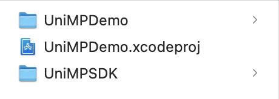
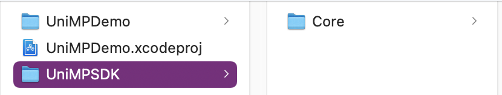
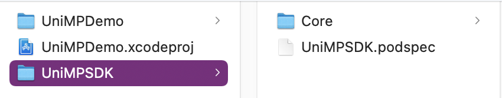
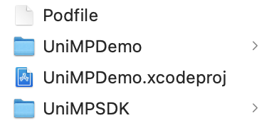
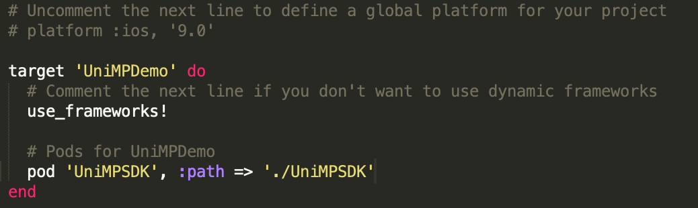

# UniMPSDK

#### 简介

uni小程序SDK，是为原生App打造的可运行基于 [uni-app](https://uniapp.dcloud.io/) 开发的小程序前端项目的框架，从而帮助原生App快速获取小程序的能力。

#### 集成方式

* 参考官方的[集成教程](https://nativesupport.dcloud.net.cn/UniMPDocs/UseSdk/ios)

* ~~使用cocoapods集成：`pod 'UniMPSDK'`~~ GitHub的免费Git LFS限额不足

* 使用cocoapods集成本地库

  1.比如有个`UniMPDemo`的iOS项目，在`UniMPDemo.xcodeproj`所在目录新建文件夹，比如叫`UniMPSDK`

  

  2.在[官网下载](https://nativesupport.dcloud.net.cn/UniMPDocs/SDKDownload/ios)任意版本的`UniMP iOS SDK`，解压后将其中的Core文件夹复制到之前新建的`UniMPSDK`中

  

  3.另外再新建一个`UniMPSDK.podspec`文件或者使用pod命令创建

  

  4.用文本编辑打开`UniMPSDK.podspec`文件，复制以下内容进去

  ```ruby
  Pod::Spec.new do |s|
  
    s.name          = "UniMPSDK"
    #设置为你下载的版本
    s.version       = "0.0.1"
    s.summary       = "UniMPSDK"
    s.homepage      = "http://EXAMPLE/UniMPSDK"
    s.license       = "MIT"
    s.author        = {'author' => 'author'}
    s.source        = { :git => "http://EXAMPLE/UniMPSDK.git", :tag => s.version}
    s.requires_arc  = true
    s.static_framework = true
    s.pod_target_xcconfig = { 'EXCLUDED_ARCHS[sdk=iphonesimulator*]' => 'arm64'}
    s.user_target_xcconfig = { 'EXCLUDED_ARCHS[sdk=iphonesimulator*]' => 'arm64'}
    s.frameworks = "JavaScriptCore", "CoreMedia", "MediaPlayer", "AVFoundation", "AVKit", "GLKit", "OpenGLES", "CoreText", "QuartzCore", "CoreGraphics", "QuickLook", "CoreTelephony", "AssetsLibrary", "CoreLocation", "AddressBook"
    s.libraries = "c++"
  
    s.default_subspecs = "Core"
  
    s.subspec "Core" do |ss|
      ss.subspec "Headers" do |sss|
        sss.source_files = "Core/Headers/*.h"
  
        sss.subspec "weexHeader" do |ssss|
          ssss.source_files = "Core/Headers/weexHeader/*.h"
        end
      end
  
      ss.subspec "Libs" do |sss|
        sss.vendored_library = "Core/Libs/*.a"
        sss.vendored_frameworks = "Core/Libs/*.framework"
      end
    end
  
    s.resources = ["Core/Resources/*.js", "Core/Resources/*.ttf", "Core/Resources/*.bundle"]
  end
  ```

  5.回到`UniMPDemo.xcodeproj`所在目录，通过命令`pod init`生成`Podfile`

  

  6.打开`Podfile`文件，添加一行代码`pod 'UniMPSDK', :path => './UniMPSDK'`

  

  7.最后使用`pod install`将SDK集成到项目中即可